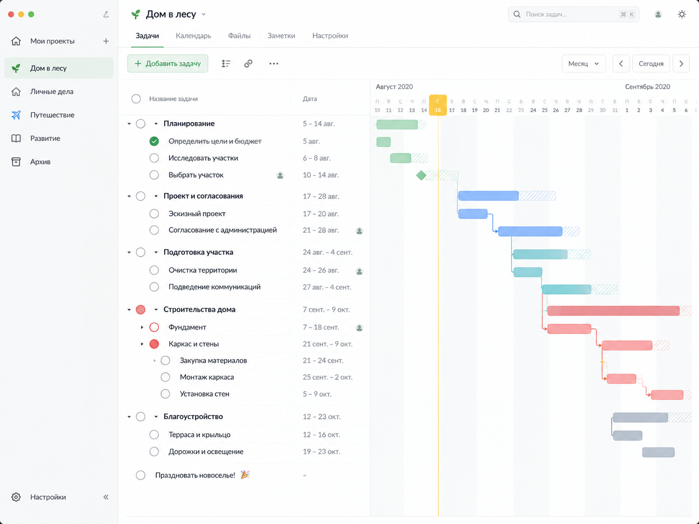

# leaf

Лёгкий self-hosted планировщик с видимой иерархией задач. Целевой первый релиз включает Гант, зависимости и пересчитываемый критический путь.

**Сейчас реализованы S0–S3:** локальный вход, сохраняемое дерево, Гант, параметры плана в компактной правой панели и визуальная схема зависимостей. Сервер пересчитывает рабочие календари, критические пути, резервы и конфликты; изменения атомарны и отменяются целиком. **Это промежуточный этап, не готовая V1:** повседневный UX/доска, restore/import/export и релизная приёмка остаются S4–S6.

**Разработчику или AI-агенту: начать с [START_HERE.md](START_HERE.md).**



## Локальный запуск

Нужны Node 24.21.0, npm 11.19.0, Python 3 и make для reviewed native install. Runtime storage хранится вне checkout. Используйте отдельные синтетические данные для разработки.

```sh
make install
make build
make admin-setup
make dev
```

Make использует `LEAF_DATA_DIR` из окружения или аргументов; по умолчанию — `~/.local/share/leaf-dev` вне репозитория. Например, `make dev LEAF_DATA_DIR=/var/tmp/leaf-development`. При выборе другого каталога передавайте его также в `admin-setup`, `start` и команды БД. Повторный запуск — `make dev`; настройка аккаунта нужна только один раз на базу.

Откройте http://127.0.0.1:5173. Настройка аккаунта требует интерактивный терминал, скрытый ввод и подтверждение пароля; default account и удалённого setup нет. API работает на loopback:3000; `LEAF_PORT` меняет серверный порт и Vite proxy; `LEAF_DEV_PORT` меняет порт Vite и его origin по умолчанию. `make start` обслуживает собранную SPA и API на http://127.0.0.1:3000; origin по умолчанию соответствует серверному порту. Если `LEAF_PUBLIC_ORIGIN` задан в окружении, он должен совпадать с адресом браузера. Ctrl+C (SIGINT) или SIGTERM останавливают приложение.

`make` или `make help` показывает все команды. Makefile вызывает существующие npm-скрипты; прямой запуск через npm описан в [BOOTSTRAP](docs/BOOTSTRAP.md).

| Команда | Действие |
|---|---|
| `make install` / `make build` | Установка зависимостей / сборка |
| `make admin-setup` | Интерактивная настройка аккаунта после сборки |
| `make admin-reset-password` | Сборка и локальная смена пароля с сохранением задач |
| `make dev` / `make start` | Разработка / запуск собранного приложения |
| `make verify` | Typecheck, lint, unit/integration tests и сборка |
| `make test-unit` / `make test-integration` | Отдельные группы тестов |
| `make install-browser` / `make test-e2e` | Установка Chromium / сборка и браузерные тесты |
| `make format-check` / `make check-package` | Форматирование / границы Docker-пакета |
| `make db-migrate` / `make db-backup BACKUP=/var/tmp/leaf-backups/new-snapshot.sqlite` | Миграции / резервная копия после сборки |
| `make doctor` / `make preflight` | Среда / kit и privacy проверки |

Production-контейнер и локальные Docker команды описаны в [DEPLOYMENT](docs/DEPLOYMENT.md). Реальная контейнерная проверка выполнена на Linux ARM64; другие архитектуры ещё не проверены.

Если пароль не подходит, остановите `make dev` через Ctrl+C, выполните `make admin-reset-password`, введите новый пароль дважды и снова запустите `make dev`. Используйте тот же `LEAF_DATA_DIR`, что при запуске приложения. Проекты и задачи сохраняются; старые сеансы и история отмены очищаются. Команда требует локальный интерактивный терминал и не принимает пароль в аргументах или переменных окружения. Для прямого npm-запуска после сборки: `npm run admin:reset-password` с явно заданным `LEAF_DATA_DIR`.

## Планирование в интерфейсе S3

«План проекта» задаёт начало, календарь и часовой пояс для линии «Сегодня». У задачи на вкладке «Детали» явно выбирается режим: пометки без планирования, Auto с длительностью и ограничением «Не раньше» или Fixed с закреплёнными датами. Вычисленные значения и пользовательские ограничения различимы. Завершённую работу сначала нужно вернуть в работу; даты сводной строки рассчитываются по потомкам.

Гант включается переключателем над деревом. Общие строки сохраняют вложенность и синхронную вертикальную прокрутку; шкала имеет дни/недели/месяцы и отдельную горизонтальную прокрутку. Перенос Auto задаёт «Не раньше», правый край меняет длительность. Клавиши ←/→ сдвигают на рабочий день; Shift+←/→ меняет окончание. Esc отменяет жест. Один жест — одна операция и одна отмена. Даты незапланированных задач остаются отметками без фиктивных полос.

«Зависимости» показывает непосредственных предшественников и последователей, отдельную стрелку для каждой связи и критичность. Поиск предлагает допустимые конечные работы; цикл объясняется цепочкой названий. Удаление убирает только связь. Можно перейти к соседу, вернуться и показать выбранную работу на Ганте. Для больших соседств доступно постраничное «Показать ещё».

## API расписания

Команды `/api/projects/:id/commands` используют `expectedRevision` и UUID `operationId`. Ответ дерева содержит исходные задачи, зависимости, новую ревизию и согласованный `schedule`. GET `/api/projects/:id/schedule` возвращает `{ projectId, revision, schedule }` и требует входа.

| Команда | Назначение |
|---|---|
| `project.schedule` | Начало проекта, календарь «пн–пт» / «все дни», часовой пояс |
| `task.plan` | Явный режим `unscheduled`, `auto` с длительностью или `fixed` с включительными датами |
| `task.edit` | Текст/статус и необязательный план в одной транзакции и одной отмене |
| `dependency.create` / `dependency.delete` | FS без лагов между конечными задачами одного проекта |
| `undo` | Отмена всей операции, включая настройки, связи и пересчёт |

Иерархия не создаёт зависимость. Неизвестная длительность не равна нулю. Без начала проекта можно рассчитать относительные дни; абсолютные ограничения требуют начала и дают `incomplete`. Нарушенные закреплённые интервалы сохраняются с `infeasible` и диагностикой, без обычного критического пути. Дедлайн остаётся отдельным предупреждением; изменение длительности не стирает его. Завершённая работа сохраняет свой рассчитанный интервал.

Миграция 002 применяется при запуске и сохраняет прежние даты как незапланированные пометки. Старый формат истории операций/отмены очищается; проекты, задачи и аккаунт сохраняются. Перед обновлением рабочей установки остановите сервер и сохраните согласованный backup. Миграционные проверки разработки используют только синтетические базы. Подробности — в [SCHEDULING](docs/SCHEDULING.md) и [ADR 004](docs/adr/004-scheduling-transactions.md).

## Проверки

```sh
npm run verify
npm run format:check
npm run check:package
npm exec playwright -- install --with-deps chromium
npm run test:e2e
```

`verify` запускает typecheck, lint, настоящие unit/integration tests и build. E2E использует собранный сервер, собственные временные синтетические SQLite-базы и реальные перезапуски процессов. Снимки остаются вне checkout, traces/video выключены. Kit/privacy проверки выполняются отдельно:

```sh
npm run check:kit
npm run test:kit
npm run doctor
npm run preflight
```

Preflight требует Git, Gitleaks и установленные hooks; подготовка — в [BOOTSTRAP](docs/BOOTSTRAP.md). Он проверяет безопасность репозитория и комплект, а не поведение приложения.

## Хранение

```sh
npm run db:migrate
npm run db:backup -- /var/tmp/leaf-backups/new-snapshot.sqlite
```

Обе команды используют `LEAF_DATA_DIR`. Backup создаёт согласованный snapshot SQLite через native API, включая актуальный WAL, и отказывает при существующем destination. Файл содержит аккаунт и задачи; он приватный. Restore и проектный JSON import/export ещё не реализованы (S5).

## Навигация

| Документ | Содержание |
|---|---|
| [START_HERE.md](START_HERE.md) | Точка входа и текущие этапы |
| [Проект](docs/PROJECT.md) / [Решения](docs/DECISIONS.md) | Функциональность, ограничения, допущения |
| [Дизайн](design/README.md) | Только три выбранных макета |
| [Планировщик](docs/SCHEDULING.md) | Семантика дат, зависимости, CPM, конфликты |
| [Архитектура](docs/ARCHITECTURE.md) | Стек, данные и границы модулей |
| [План](docs/IMPLEMENTATION_PLAN.md) / [Приёмка](docs/ACCEPTANCE.md) | Этапы и проверяемые критерии |
| [Безопасность публикации](docs/PRIVACY.md) | Секреты, личные данные, история Git |
| [Статус](docs/STATUS.md) / [Проверка комплекта](docs/VALIDATION.md) | Что сделано и проверено |

## Публикация и лицензия

Production-данные и конфигурация не входят в публичный репозиторий или образ. См. [SECURITY.md](SECURITY.md) и [LICENSE-NOTE.md](LICENSE-NOTE.md). Лицензия ещё не выбрана владельцем. Push, публикация образа и deployment требуют отдельного поручения; CI их не выполняет.
