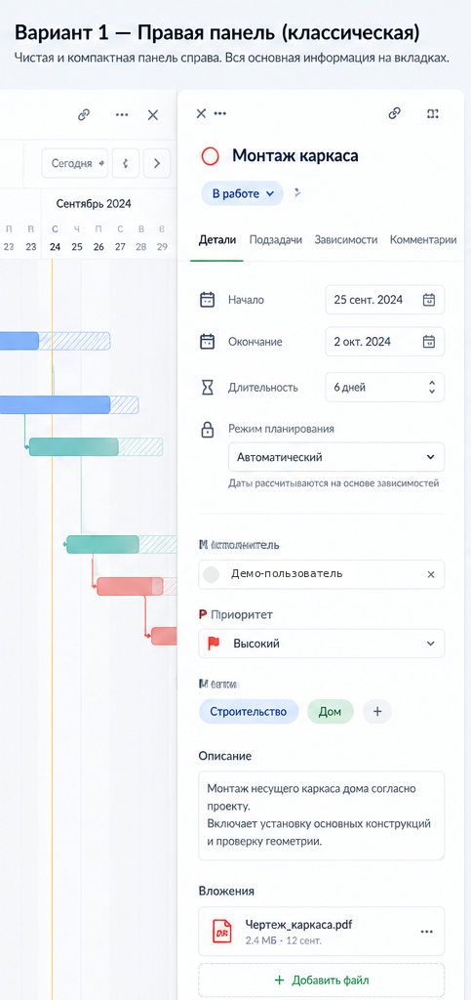
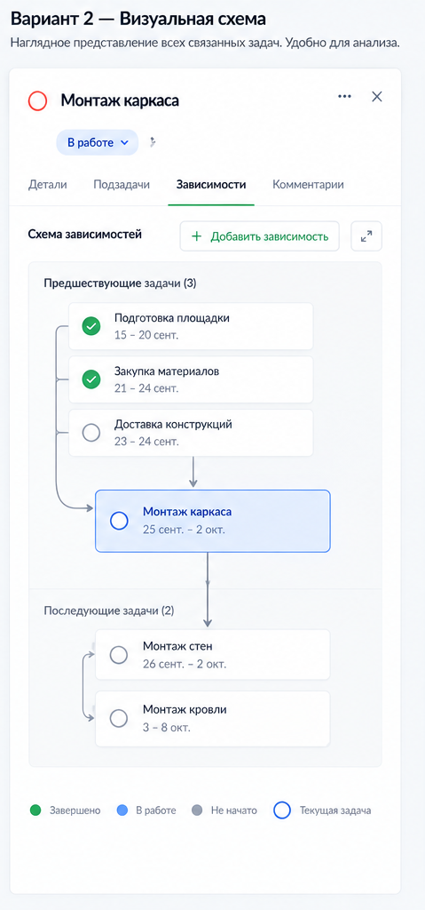

# Выбранные UI-референсы leaf

**Именно эти три изображения используются при разработке.** Это выбранные концептуальные макеты из обсуждения, а не скриншоты готового приложения leaf.

## 01 — главное окно

Выбран светлый вариант «Дом в лесу»: проекты слева, лёгкое дерево и компактная колонка дат в центре, Гант справа. Сохранять воздух, тонкие разделители, мягкие цвета, ясную вложенность. Аватары заменены нейтральными значками для публикации. Названия и даты демонстрационные.

## 02 — правая панель задачи, вариант 1

Вырезан только выбранный первый вариант из коллажа. Нужна компактная панель справа, не широкая форма и не центральное модальное окно. Иллюстративное имя заменено нейтральной подписью. Поля, отсутствующие в scope, не переносить автоматически.

## 03 — зависимости, вариант 2

Вырезан только выбранный второй вариант. Предшественники сверху, выбранная задача в центре, последователи снизу. Каждая стрелка должна представлять реальную связь; не повторять случайные неточности рисунка.

## Ограничения

[Рабочий прототип иерархической доски](prototypes/hierarchical-board.html) подготовлен в S4 на синтетических данных для проверки владельцем. Открывается локально в браузере, позволяет сворачивать группы мышью и клавиатурой. Это предложение по O03, не четвёртый утверждённый референс и не подключённая к серверу функция. Изменение статуса и undo доски остаются следующей задачей после проверки компоновки.

Последний коллаж вкладки «Подзадачи» **не включён и не является референсом**. Других утверждённых экранов нет. Сырой скрин сайта Quire, полный чат и отклонённые варианты не включены.

Снимки задают визуальное направление, но не являются спецификацией расчётов или обязательством реализовать все нарисованные поля. Штрихованные полосы неизвестной длительности, ошибочные даты и некорректные FS-стрелки с макетов не переносить в приложение. Правила продукта имеют приоритет.

Имена и аватары в исходных концепциях были иллюстративными; для публичной версии видимые идентификаторы дополнительно обезличены. PNG перепакованы без текстовых/EXIF-метаданных. Другие личные данные для комплекта не использовались. Хэши опубликованных байтов — в `config/public-assets.json`.

`tokens.css` — предлагаемая стартовая палитра и геометрия, не дополнительный утверждённый макет. Не загружать шрифты с внешних CDN и не копировать бренд/логотип Quire; бренд приложения — leaf.
